# Podcast Platform: MediaSound

## Do you want a platform where you can listen to anything, without censorship and opting for free-speech, completely free?

Here, in __MediaSound__, we want to create a free-license platform to upload whatever you want to say and hear. We take people's safety and freedom seriously. __MediaSound__ is one of our newest platform using backend system with _object-oriented design_, _design patterns_, and some _good code practices_ in order to provide a __RESTful API__ with different services related to podcasting.

## Business Model

This is a podcasting media system where users could find, create and manage podcasts, playlists with a user, among other, using a web platform. The scope of the current project is to provide a set of services to be used by different users among the platform.

### Business Rules
  
- Podcasts will reach users by popularity.
- People have complete freedom to upload podcasts to the platform.
- Recommendations must be related to current topics.
- Users will be able to create a single account within the platform.

## User Stories:

__As a__ _user_, __I want__ to access my personalized profile __to that__ view and edit my personal information, such as my name, email, and profile picture.

__As a__ _podcaster_, __I want__ to be able to upload audio files in some formats like MP3 and WAV __to that__ publish my podcasts.

__As a__ _podcaster_, __I want__ to see the views, rating and comments of my podcasts __to that__ improve my content.

__As a__ _user_, __I want__ to be able to leave comments and ratings on podcasts __to that__ interact with other users and content creators.

__As a__ _user_, __I want__ to be able to create personalized playlists, either public or private, __to that__ organize my favorite podcasts.

__As a__ _user_, __I want__ to be able to follow other content creator users __to that__ stay updated on their new releases.

__As a__ _user_, __I want__ playback controls such as play, pause, forward, rewind, volume adjustment, __so that__ control the playback of the podcast.

__As a__ _user_, __I want__ to be able to search for podcasts by title, description, user, tags, and categories __so that__ find specific podcasts or discover new ones.

__As a__ _user_, __I want__ to be able to get podcasts recommendations by categories, tags, popularity, and trends __to that__ discover new content.

## Technical Definitions

__Podcaster:__ People who has posted any Podcast.
__Podcast:__ An audio content format distributed in different filetypes.
__Playlist:__ A set of podcasts classified by user.
__Media player:__ Interface that plays audio on the platform.

### Tools to Use

In this case, the backend will be build using _Python 3.10_, and some related technologies as _Fast API_ to serve functionalities, _PyTest_ to apply some simple unit tests, and _Black_ to auto-format the code and increase code readibility.

## Entities:

__User:__ name, mail, password, profile, profile photo, info, preference, getName(), changeName(), getMail(), changeMail(), changePassword(), addInfo, changeInfo(), addPreference(), changePreference(), deleteUser(), Podcaster[E]

__Podcaster:__ alias, rate, getPodcast(), Podcast[E]

__Podcast:__ author, uuidPodcast, genre, title, uploadDate, duration, program, description, audioQuality, format, tag, category, language, ratePodcast(), addPodcast(), deletePodcast(), hidePodcast(), getInfoPodcast(), Playlist[E]

__Playlist:__ name, uuidPlaylist, amountPodcast, descriptionPlaylist, addPlaylist(), deletePlaylist(), openPlaylist(), closePlaylist(), addPodcastPlaylist(), removePodcastPlaylist(), playPlaylist(), getAmountPlaylist(), User[E]

__MediaPlayer:__ volume, playback, state, setVolume(), setPlayback(), playMedia(), pauseMedia(), getVolume(), getState(), queuePodcast(), getQueue(), loadPodcast(), getCurrentPodcast(), getCurrentTime(), Podcast[E]

## Processes 

- Playlist creation.

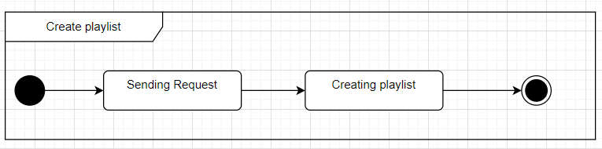
  
- Playlist custom management.

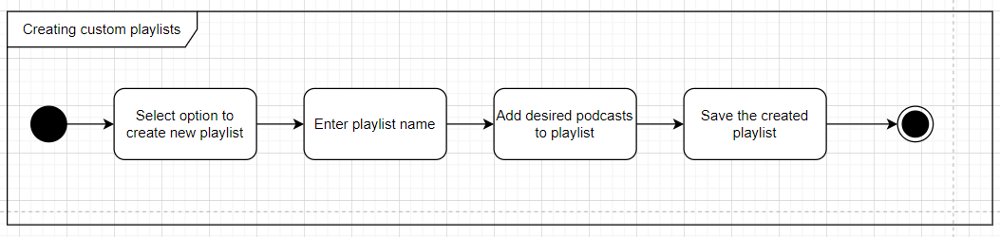

- Podcast upload.

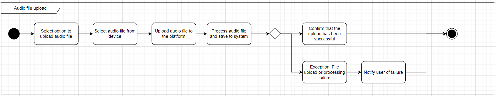

- Podcast management.

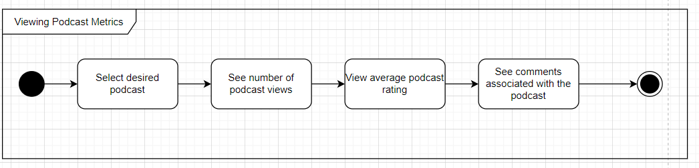
  
- Podcast interaction.

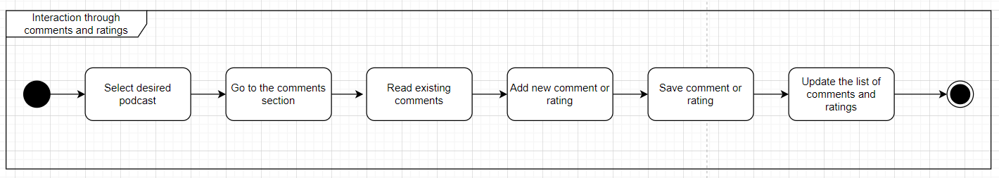

- Podcast search.

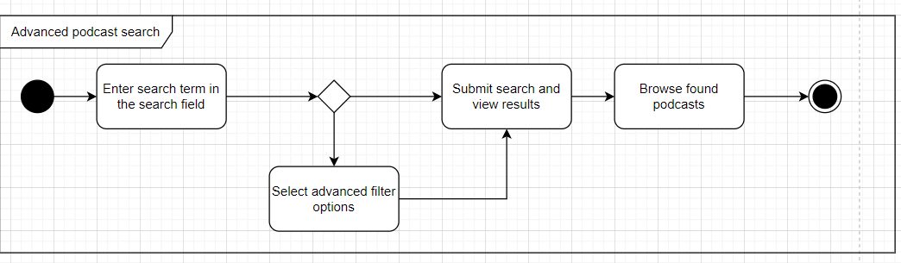
  
- User management.

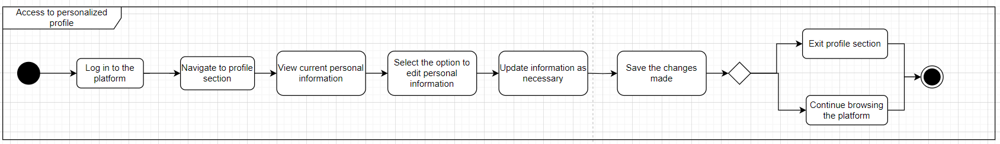

## States

- User login.

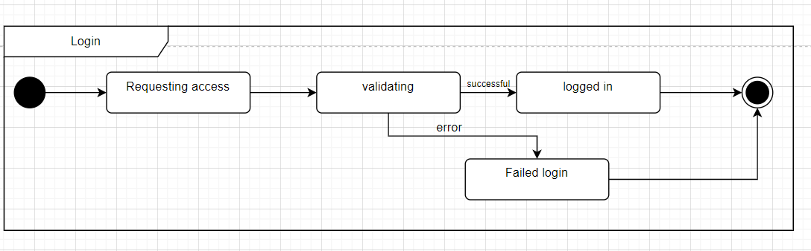

- Playlist and Podcast interaction.

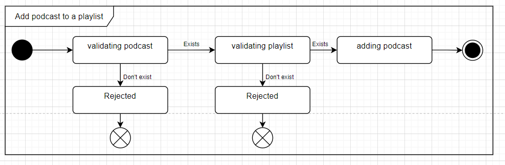

- Media player configuration.

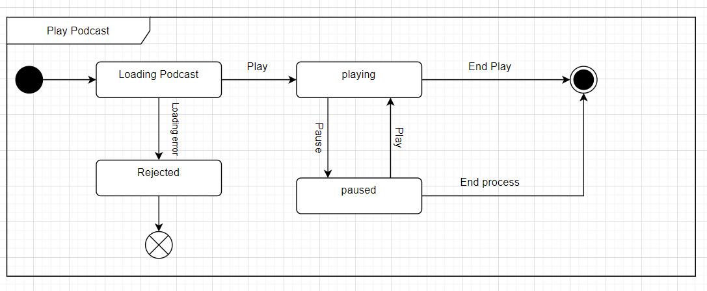

## Diagrams

- Deployment Diagram
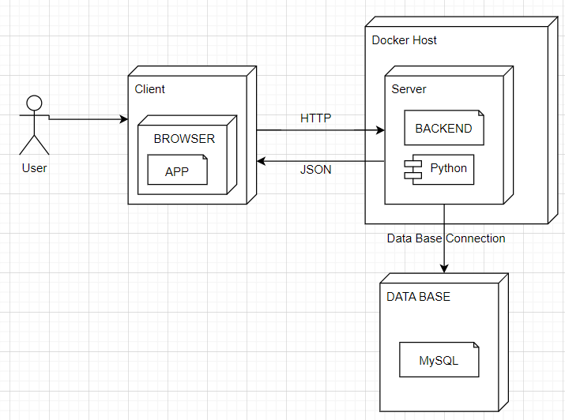

- Conceptual Model.

- Entity-Relation Model.

- CRC Cards.

